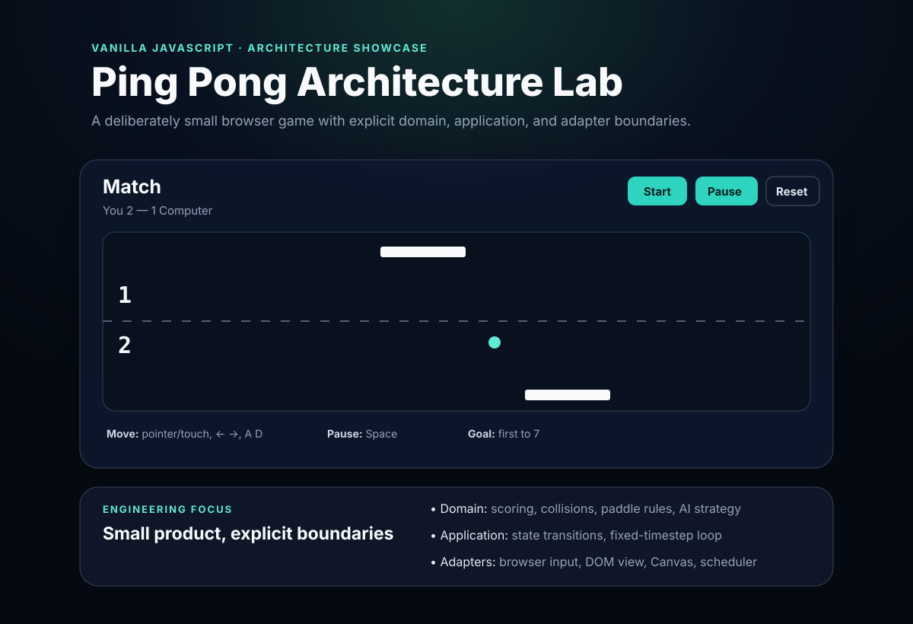

# Ping Pong Architecture Lab

[](https://github.com/MykolaDotsenko/Ping-pong-Js-game/actions/workflows/quality.yml)

A dependency-free browser Ping Pong game built as a compact **software architecture case study**.

The project deliberately stays on Vanilla JavaScript and Canvas so the engineering decisions remain visible: explicit dependency direction, browser-agnostic core logic, deterministic simulation, replaceable adapters, and automated verification.

**[Live demo on GitHub Pages](https://mykoladotsenko.github.io/Ping-pong-Js-game/)**



## Why this project exists

This is not an attempt to build the largest Pong implementation. It demonstrates how to apply proportional architecture to a small product without hiding complexity behind a framework.

The original 2024 version used one global script for rendering, input, physics, AI, scoring, and lifecycle. The current version separates those concerns and makes the important rules independently testable.

## What it demonstrates

- browser-agnostic **domain + application core**
- explicit state machine: `ready → running ↔ paused → game-over`
- fixed-timestep simulation independent from display refresh rate
- swept paddle collision using the exact crossing point
- paddle-hit angle derived from contact position
- speed-capped opponent strategy with lightweight prediction
- input, DOM view, Canvas rendering, and frame scheduling as adapters
- one authoritative state owner
- ESLint static analysis
- Node built-in unit tests for domain rules and edge cases
- Playwright smoke tests on desktop and mobile Chromium
- GitHub Actions quality gates
- responsive semantic shell with keyboard, pointer, and touch controls

## Stack

- semantic HTML5
- modern CSS
- Vanilla JavaScript with native ES modules
- Canvas 2D
- Node.js built-in test runner
- ESLint 10
- Playwright Test 1.63
- GitHub Actions

There is intentionally **no React, game engine, state library, dependency-injection framework, or runtime dependency**. Those tools would add surface area without solving a requirement in this product.

## Architecture

```text
Browser shell
    |
script.js (composition root)
    |
    +-- InputController ------------ browser input adapter
    +-- DomGameView ---------------- DOM output/command adapter
    +-- CanvasRenderer ------------- Canvas output adapter
    +-- BrowserFrameScheduler ------ timing adapter
    |
    +-- GameController ------------- application orchestration
            |
            +-- FixedStepLoop ------- deterministic timing policy
            |
            +-- domain/game
                    |
                    +-- physics
                    +-- opponent strategy
```

**Dependency rule:** browser details depend on the core; the core never depends on browser APIs.

CI enforces this boundary by scanning `src/domain/` and `src/application/` for browser-only APIs.

See [ARCHITECTURE.md](./ARCHITECTURE.md) for the design rationale and trade-offs.

## Project structure

```text
.
├── .github/workflows/quality.yml
├── docs/preview.svg
├── e2e/game.spec.js
├── scripts/check-project.mjs
├── src
│   ├── adapters
│   │   ├── browser-frame-scheduler.js
│   │   ├── canvas-renderer.js
│   │   ├── dom-game-view.js
│   │   └── input-controller.js
│   ├── application
│   │   ├── game-controller.js
│   │   └── game-loop.js
│   ├── domain
│   │   ├── game.js
│   │   ├── opponent.js
│   │   └── physics.js
│   └── config.js
├── tests
│   ├── game.test.js
│   ├── game-loop.test.js
│   ├── opponent.test.js
│   └── physics.test.js
├── ARCHITECTURE.md
├── eslint.config.js
├── index.html
├── package.json
├── playwright.config.js
├── script.js
└── style.css
```

## Run locally

The game itself has no runtime installation step. Because it uses native ES modules, serve the directory over HTTP:

```bash
python3 -m http.server 8000
```

Then open `http://localhost:8000`.

For quality tooling:

```bash
npm install
npm run check
npx playwright install chromium
npm run test:e2e
```

## Controls

- pointer / mouse / touch — move the player paddle
- `←` / `→` — keyboard movement
- `A` / `D` — keyboard movement
- `Space` — start or pause/resume

First to 7 wins.

## Verification strategy

### Static and structural checks

`npm run check` runs:

1. ESLint static analysis
2. dependency-free unit tests
3. project-structure checks
4. architecture-boundary checks

The architecture check fails if browser concerns such as `window`, `document`, Canvas APIs, event listeners, or animation-frame APIs leak into the domain/application core.

### Browser smoke tests

Playwright runs the real application in desktop and mobile Chromium and verifies:

- the application boots without page errors
- the Canvas and core UI are visible
- Start transitions into a running match
- Space pauses and resumes
- Reset returns to the ready state
- pointer interaction is accepted on the responsive Canvas

### Domain edge cases

Unit tests cover:

- state-machine transitions
- paused-state immutability
- player bounds
- point scoring without double-counting
- game-over transition
- serve direction
- wall reflection
- center/off-center paddle bounce
- maximum speed cap
- swept high-speed paddle crossing
- opponent speed cap and legal bounds

## Architecture trade-offs

A tiny game does not justify enterprise layers. Every boundary here solves a concrete problem:

- physics must be testable without Canvas
- the application core must not know about the browser
- input devices must not mutate state directly
- refresh rate must not control simulation speed
- browser frame scheduling must be replaceable
- rendering must not decide scoring or collisions
- dependencies must remain obvious at the composition root

The project deliberately avoids repositories, factories, event buses, service locators, and other abstractions that would not reduce a real coupling.

## Recruiter walkthrough

If you have two minutes, inspect these files in order:

1. [`script.js`](./script.js) — composition root and dependency wiring
2. [`src/application/game-controller.js`](./src/application/game-controller.js) — orchestration without browser APIs
3. [`src/domain/game.js`](./src/domain/game.js) — state transitions and scoring
4. [`src/domain/physics.js`](./src/domain/physics.js) — swept collision and bounce rules
5. [`scripts/check-project.mjs`](./scripts/check-project.mjs) — executable architecture constraints
6. [`.github/workflows/quality.yml`](./.github/workflows/quality.yml) — automated verification

## Author

Mykola Dotsenko
