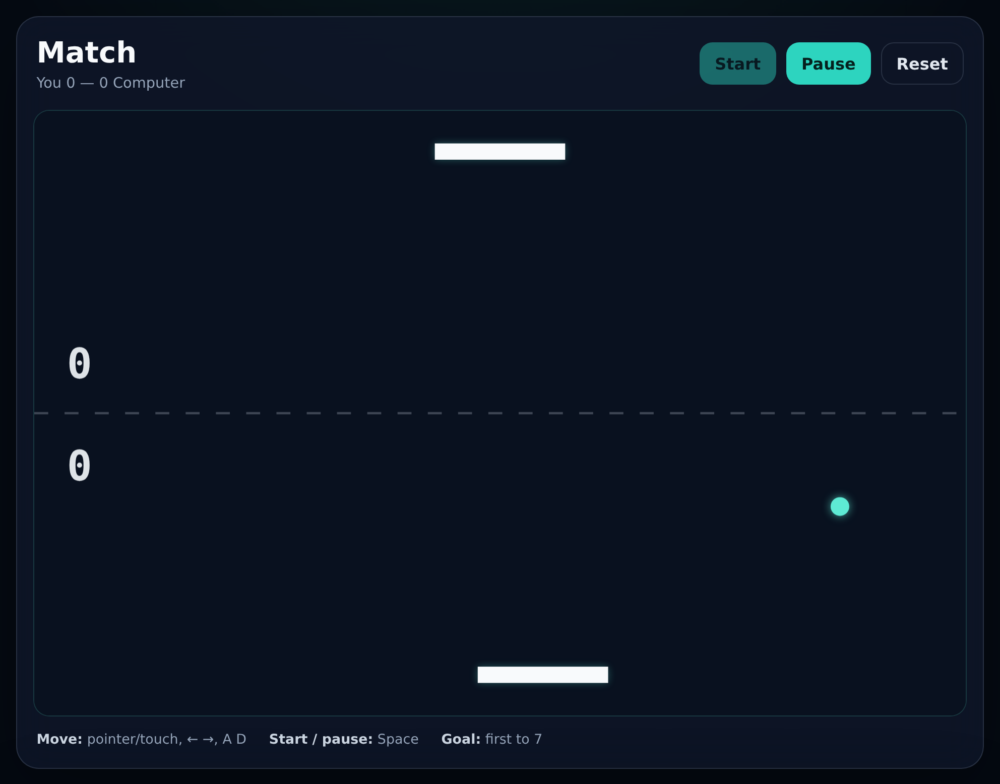

# Ping Pong Architecture Lab

[](https://github.com/MykolaDotsenko/Ping-pong-Js-game/actions/workflows/quality.yml)

A neon arcade Ping Pong for phones and desktops, built without dependencies as a compact **software architecture case study**.

The project deliberately stays on Vanilla JavaScript, Canvas and Web Audio so the engineering decisions remain visible: explicit dependency direction, browser-agnostic core logic, deterministic simulation, replaceable adapters, and automated verification.

**[Play the live demo](https://mykoladotsenko.github.io/Ping-pong-Js-game/)**. On a phone, add it to your home screen for full-screen play.



The preview is a real frame of a live match, captured from the running app by `npm run docs:preview`.

## Why this project exists

This is not an attempt to build the largest Pong implementation. It demonstrates how to apply proportional architecture to a small product without hiding complexity behind a framework, and how far a small, well-structured core can be pushed in feel and polish.

The original 2024 version used one global script for rendering, input, physics, AI, scoring, and lifecycle. The current version separates those concerns and makes the important rules independently testable.

## The game

- **Three ways to play.** **Solo** against the computer, first to 7. **Rush**, a survival run with three lives against a computer that returns everything but a curve, where the ball only gets faster and your score is the number of hits. **2P**, two people on one phone, each steering their own end of the court.
- **Portrait neon court** that fills a phone held upright and reads as a vertical arcade cabinet on desktop.
- **Curve shots:** flick the paddle as it meets the ball and the ball bends in that direction. The computer cannot predict a curve.
- **Power-ups** appear mid-rally and go to whoever hit the ball last: **Wide** enlarges your paddle, **Shrink** shrinks the other side's, **Turbo** turns your shot into one blistering ball until it is returned, and **Ghost** hides the ball in the other side's half. They can be switched off.
- **A computer that plays like a person:** it reacts only once the ball comes within its reach, aims its returns away from you, and misjudges fast balls more.
- **Three difficulties** — Easy, Normal, Hard — tuned by simulating matches against human-like bots.
- **Drama:** a 3-2-1 countdown before the first serve, a **Match point** banner, slow motion as a match-point ball closes on a paddle, a split-second freeze on hard hits, and callouts for a **CURVE!**, a **SMASH!** or an **EDGE!** catch.
- **Rallies that build:** every hit speeds the ball up, the rally counter pulses, long rallies heat the ball into a "fever" glow, and the music adds a layer at 3 hits and another at 6.
- **Juice:** sparks, shockwaves, screen shake, flashes, a speed-heated ball trail and victory fireworks, with synthesized sound effects, a synthesized backing track and vibration.
- **Five backing tracks**, all original and synthesized in the browser: **Neon** (synthwave), **Arena** (arcade fighter techno), **Anthem** (a big synth-brass anthem), **Contender** (training-montage rock) and **Iron** (heavy industrial). The ♪ button in the menu or the pause screen switches track and plays a few seconds of it.
- **Thumb rail:** on touch screens, a strip below the court steers the paddle, so your thumb never covers the play.
- **Solid paddles:** the ball meets a paddle's face, corners and sides as solid shapes. Clip a front corner and it comes back from the edge; catch it on the side and it glances off, but it never passes through. Once you have missed, a paddle moved into the ball stops against it instead of dragging it along.
- **Made for the phone:** a first-visit tutorial, full-screen mode, the screen stays awake during a match, and a Share button for a result. The heads-up display fits even a 320px-wide screen.
- Mode, difficulty, power-ups, sound, music and its track, vibration, your best rally, your best Rush run and your Solo win record are remembered between visits, and stay in step across open tabs. Leaving a Solo match after its first point counts as a loss, so a streak is earned, not protected.

## What it demonstrates

- browser-agnostic **domain + application core**, kept deterministic (no clock, no randomness)
- explicit state machine: `ready → running ↔ paused → game-over`
- **domain events** (`paddle-hit`, `point`, `match-point`, `pickup`, `game-over`, …) emitted by the simulation and turned into sound, music, vibration and visual effects by independent adapters
- **rules as data:** a match and a Rush run share one simulation; the rules object decides how a point counts
- a **deterministic random source** kept in the game state, so power-ups vary between matches while the same seed replays a match exactly
- a fixed-step loop with a **time scale and hit-stop hold**, so slow motion and freeze frames never touch the simulation's step size
- fixed-timestep simulation with render interpolation, independent from display refresh rate
- a render loop that runs only during a match; idle screens cost no frames
- swept ball-against-paddle contact in the paddle's frame of reference: no tunnelling at any speed, solid corners and sides, and a property test that finds no overlap in over 100,000 simulated steps; plus contact-position bounce angles and spin that bends the path without changing speed
- typed ports: adapter contracts written as JSDoc and checked by the TypeScript compiler, with no build step
- adapters that receive browser globals by injection, so input, view, sound, vibration and storage are unit-tested in Node
- a Canvas renderer built for phones: pre-rendered glow sprites and background layers, additive blending, and a capped pixel ratio
- layer boundaries enforced by ESLint, with tests proving the rules still reject violations
- unit tests behind an honest coverage gate: every module is loaded, so an untested file counts at 0%, and each file must clear its own floor, not just the average
- accessible overlays: a native modal tutorial with managed focus, labelled pause and result dialogs, and decorative glyphs hidden from screen readers
- Playwright tests on desktop and mobile Chromium that assert on the rendered canvas
- an installable web app (manifest and icons) with safe-area-aware, reduced-motion-aware styling

## Stack

- semantic HTML5
- modern CSS (container queries, `:has()`, `dvh` units, safe-area insets)
- Vanilla JavaScript with native ES modules
- Canvas 2D and Web Audio
- Web App Manifest
- Node.js built-in test runner and coverage
- ESLint 10
- TypeScript 7, for JSDoc type-checking only
- Playwright Test 1.63
- GitHub Actions, for the checks and for deploying `main` to GitHub Pages

There is intentionally **no React, game engine, audio library, state library, dependency-injection framework, bundler, or runtime dependency**. Those tools would add surface area without solving a requirement in this product. TypeScript only checks the JavaScript that ships; nothing is compiled, and every sound is synthesized at play time.

## Architecture

```text
Browser shell
    |
script.js (composition root: the only place that touches browser globals)
    |
    +-- InputController ------------ pointer, touch rail and keyboard input
    +-- DomGameView ---------------- HUD, menus and settings around the board
    +-- CanvasRenderer ------------- neon rendering and visual effects (canvas/*)
    +-- SoundBoard ----------------- synthesized sound effects  ─┐
    +-- MusicPlayer ---------------- a backing track that builds ┴─ AudioOutput (one context)
    +-- Haptics -------------------- vibration
    +-- WakeLock ------------------- keeps the screen on during a match
    +-- BrowserDevice -------------- sharing and full screen
    +-- LocalPreferences ----------- mode, difficulty, settings and records
    +-- BrowserFrameScheduler ------ timing
    |
    +-- GameController ------------- application orchestration
            |
            +-- ports -------------- adapter contracts and commands
            +-- FixedStepLoop ------- deterministic timing policy
            +-- interpolateState ---- smooth rendering between steps
            |
            +-- domain/game --------- state machine, rules, scoring, events
                    |
                    +-- physics ----- swept paddle contact, bounce angles, spin
                    +-- opponent ---- reach, prediction, aim, misjudgement
                    +-- power-ups --- pickups, effects, a seeded random source
```

**Dependency rule:** browser details depend on the core; the core never depends on browser APIs.

ESLint enforces the rule per directory: the domain and application layers see no host globals, cannot read the clock or `Math.random`, and cannot import outward. `tests/architecture-rules.test.js` feeds violations to ESLint to prove the rules keep working.

See [ARCHITECTURE.md](./ARCHITECTURE.md) for the design rationale and trade-offs.

## Project structure

```text
.
├── .github/workflows/quality.yml   checks on every push and PR; deploys main to GitHub Pages
├── docs/preview.png
├── e2e/game.spec.js
├── icons/                      app icons, rendered from icon.svg
├── scripts
│   ├── capture-preview.mjs
│   ├── check-project.mjs
│   ├── coverage-gate.mjs
│   └── render-icons.mjs
├── src
│   ├── adapters
│   │   ├── canvas
│   │   │   ├── ball-trail.js
│   │   │   ├── court.js
│   │   │   ├── event-effects.js
│   │   │   ├── hud.js
│   │   │   ├── scene.js
│   │   │   └── theme.js
│   │   ├── audio-output.js
│   │   ├── browser-device.js
│   │   ├── browser-frame-scheduler.js
│   │   ├── canvas-renderer.js
│   │   ├── dom-game-view.js
│   │   ├── effects.js
│   │   ├── haptics.js
│   │   ├── input-controller.js
│   │   ├── local-preferences.js
│   │   ├── music-player.js
│   │   ├── music-tracks.js
│   │   ├── sound-board.js
│   │   └── wake-lock.js
│   ├── application
│   │   ├── game-controller.js
│   │   ├── game-loop.js
│   │   ├── interpolation.js
│   │   └── ports.js
│   ├── domain
│   │   ├── game.js
│   │   ├── opponent.js
│   │   ├── physics.js
│   │   ├── power-ups.js
│   │   ├── random.js
│   │   └── types.js
│   └── config.js
├── tests                       unit tests per module, collision and module-load checks, support/ fakes
├── ARCHITECTURE.md
├── LICENSE
├── eslint.config.js
├── index.html
├── manifest.webmanifest
├── package.json
├── package-lock.json
├── playwright.config.js
├── script.js
├── style.css
└── tsconfig.json
```

## Run locally

The game itself has no runtime installation step. Because it uses native ES modules, serve the directory over HTTP:

```bash
python3 -m http.server 8000
```

Then open `http://localhost:8000`. To try it on a phone, open the same address from a device on your network.

For quality tooling:

```bash
npm ci
npm run check
npx playwright install chromium
npm run test:e2e
npm run docs:preview   # regenerate docs/preview.png after UI changes
npm run docs:icons     # regenerate the app icons from icons/icon.svg
```

## Controls

- **Touch:** drag on the court or on the thumb rail below it; a tap moves the paddle straight to that spot. In 2P, the bottom half of the court steers the bottom paddle and the top half the top one, and each finger keeps the paddle it started on.
- **Mouse:** move over the court; in 2P, press and drag
- **Keyboard:** `←` / `→` or `A` / `D` to move (by physical key, so any layout works, including Ukrainian and AZERTY), `Space` to start or pause, `Esc` to pause. Player 2 uses `J` / `L` or the numpad `4` / `6`.
- **Curve:** flick the paddle sideways as it meets the ball

Whichever device you used last steers the paddle, so the keyboard works even while the mouse rests on the board. Clicking a button hands focus back to the board, so `Space` keeps working. While the tutorial is open, `Space`, `Enter` and `Esc` belong to it: the game behind it takes no keys or touches. The match pauses by itself when the window loses focus or the tab is hidden, and the page cannot scroll away while you play. Browser shortcuts such as `Ctrl+A` are never intercepted.

First to 7 wins in Solo and 2P; in Rush, three misses end the run. The menu reads these rules from the match configuration.

## Verification strategy

### Static and structural checks

`npm run check` runs:

1. ESLint, including the per-directory architecture boundaries
2. TypeScript type-checking of the JSDoc-annotated sources
3. unit tests with a coverage gate: 95% lines and 90% branches and functions over all of `src/`, and at least 90% lines, 85% branches and 80% functions in every single file
4. project-structure checks

### Unit tests

The dependency-free unit suite covers:

- the state machine, scoring, serves, the 3-2-1 countdown, match point, and the events every transition emits
- the Rush rules (lives, hits, no win condition for the computer) and two-player steering of the top paddle
- power-ups: spawning on schedule, each effect, wear-off through serve pauses, and the computer's blindness to a ghosted ball
- the deterministic random source, so a seed replays a match
- paddle control, the speed cap, spin from a moving paddle, curves that keep their speed and never stall a rally, and a full deterministic rally
- paddle contact: faces, clipped corners, sides, a paddle run into a missed ball or yanked toward a wall, a paddle that flashes across under the ball, fast balls at any speed, and a property test over 60 bot matches in which the ball never overlaps a paddle
- the opponent's reach, wall-folded prediction, aim, speed-dependent misjudgement, and the ordering of the difficulty presets
- the fixed-step loop with its time scale and hit-stop hold, and render interpolation
- the controller: loop lifecycle, commands, the match built from mode and difficulty, slow motion and hit-stop, event dispatch to feedback adapters, the best-rally, best-Rush and win-streak records, and forfeits
- the adapters: input (layouts, shortcuts, device switching, the thumb rail, focus loss, dialogs), the view (overlays, the modal tutorial, focus, settings, rules from config, quiet live-region updates), the canvas renderer and its modules on a recording 2D context, effects, sound and music on one audio context, vibration, the wake lock, sharing and full screen, and preferences across tabs
- the architecture rules themselves, and that every module loads without a browser

### Browser tests

Playwright runs the real application in desktop and mobile Chromium. It reads the paddle and ball positions from the canvas pixels, so the tests assert on what the player actually sees, and time-sensitive checks run on a paused fake clock. They verify:

- the application boots without page errors, and Play, `Space`, `Esc` and the menus drive the state machine
- the paddle follows the mouse, the keyboard takes over while the mouse rests on the board, and `A`/`D` work on a Cyrillic layout
- on a phone, the court fills the screen, stays in view when a match starts, and the thumb rail steers the paddle; on a 320px-wide phone the heads-up display fits without sideways scrolling
- the first serve counts down from three before the ball moves
- the first visit opens the tutorial once as a modal dialog; `Space` closes it without starting a match, `Esc` closes it too, and either is remembered
- Rush shows lives as hearts and ends when they run out; two players get their own halves of the board
- mode, difficulty, power-up and sound choices survive a reload
- a lost match ends on the result screen, with full effects and no page errors, and Play again starts a new one
- losing window focus pauses the match, and idle screens request no animation frames
- the canvas matches device pixels up to twice the CSS size, and the app is installable

## Architecture trade-offs

A small game does not justify enterprise layers. Every boundary here solves a concrete problem:

- physics and the opponent must be testable without Canvas
- the application core must not know about the browser
- input devices must not mutate state directly
- refresh rate must not control simulation speed
- sound, vibration and visual effects must react to the game without the game knowing they exist
- rendering must not decide scoring or collisions
- dependencies must remain obvious at the composition root

The project deliberately avoids repositories, factories, event buses, service locators, and other abstractions that would not reduce a real coupling. Game events are plain data on the state, handed to a list of feedback adapters.

## Recruiter walkthrough

If you have two minutes, inspect these files in order:

1. [`script.js`](./script.js) — composition root and dependency wiring
2. [`src/application/ports.js`](./src/application/ports.js) — the contracts adapters implement
3. [`src/domain/game.js`](./src/domain/game.js) — state transitions, scoring and game events
4. [`src/domain/opponent.js`](./src/domain/opponent.js) — a beatable, human-like computer opponent
5. [`src/domain/physics.js`](./src/domain/physics.js) — swept paddle contact in the paddle's frame of reference
6. [`src/adapters/canvas/event-effects.js`](./src/adapters/canvas/event-effects.js) — how events become visual effects
7. [`eslint.config.js`](./eslint.config.js) — executable architecture constraints
8. [`.github/workflows/quality.yml`](./.github/workflows/quality.yml) — automated verification, then the GitHub Pages deploy once `main` is green

## License

[MIT](./LICENSE)

## Author

Mykola Dotsenko
