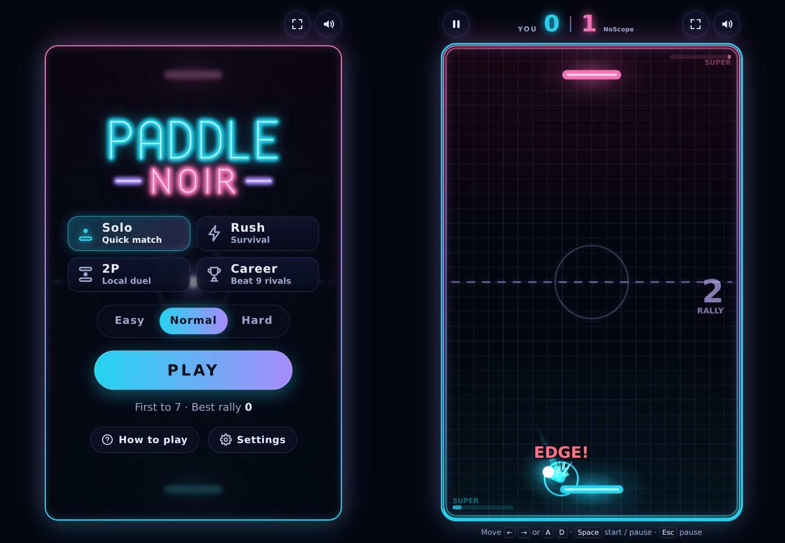

# Paddle Noir

[](https://github.com/MykolaDotsenko/paddle-noir/actions/workflows/quality.yml)

**A neon arcade ping-pong game for phones and desktops, built with Vanilla JavaScript, Canvas and Web Audio.**

[**Play Paddle Noir →**](https://mykoladotsenko.github.io/paddle-noir/)

It began as a one-script Pong exercise in 2024. The current version keeps the same small game at the center but rebuilds it around a deterministic simulation, explicit dependency boundaries and independently testable browser adapters.



## The game

Paddle Noir is meant to feel like the last surviving arcade cabinet in town, not a dashboard with a canvas in the middle.

### Modes

- **Solo** — first to 7 against the computer.
- **Rush** — three-life survival where the ball keeps getting faster.
- **2P** — two people sharing one phone or keyboard.
- **Career: The Last Arcade** — a ladder of nine opponents with different rules, ending with **The Landlord**, who wants to replace the arcade with a parking lot.

Career opponents change the same underlying simulation rather than loading separate game implementations. Boss attacks, difficulty and scoring differences are data/rules layered on top of the core match.

### Supers and arcade mechanics

Returns charge a super meter. A full meter can fire **Fireball, Zigzag, Phantom or Thunder**.

Optional power-ups add Wide, Shrink, Turbo, Ghost and Multiball. Curve shots come from paddle movement at impact rather than a separate button.

The game also includes match-point drama, long-rally escalation, synthesized music/sound, vibration, small arcade jokes and over-the-top finishing animations. Those effects are driven by domain events rather than mixed into the physics loop.

## Engineering

### Deterministic core

The match state contains its own random source. Given the same initial state and seed, the simulation can replay the same match exactly.

Core rules do not read the wall clock, browser globals or uncontrolled randomness.

### Domain events instead of browser side effects

The simulation emits events such as:

`paddle-hit` · `point` · `match-point` · `pickup` · `super-ready` · `game-over`

Independent adapters turn those events into rendering, sound, music, vibration and UI effects.

### Physics that stays stable at speed

The ball uses swept contact against a moving paddle in the paddle's frame of reference, avoiding high-speed tunnelling through the paddle.

Contact position controls bounce angle; paddle motion adds curve without changing speed.

Property-style simulation checks cover more than 100,000 steps without unresolved paddle overlap.

### Fixed-step simulation

Gameplay advances at a fixed timestep and rendering interpolates between simulation states.

Slow motion and hit-stop change time scale/hold behaviour without changing the simulation step itself.

### Rules and content as data

Solo, 2P, Rush and Career all use the same simulation.

A rules object decides how a point counts, while the Career catalogue defines opponents and boss behaviour without duplicating the engine.

## Architecture

```text
browser input ─┐
storage ───────┤
audio ─────────┤
view/canvas ───┤
               ▼
        application layer
               ↓
        deterministic domain
        match · physics · AI
               ↓
          domain events
               │
        ┌──────┴──────┐
        ▼             ▼
     render         effects
```

Browser globals are passed into adapters rather than imported into the domain.

JSDoc contracts are checked by TypeScript without compiling the JavaScript that ships.

More detail: [engineering notes](docs/engineering.md).

## What this repo demonstrates

- explicit dependency direction without a framework;
- deterministic simulation and replayable seeded randomness;
- state-machine lifecycle: `ready → running ↔ paused → game-over`;
- testable adapters for input, storage, audio and vibration;
- fixed-step physics + render interpolation;
- rules-as-data and content-as-data;
- architecture boundaries enforced by ESLint;
- recorded reference matches that catch unintended gameplay drift;
- Canvas rendering tuned for phones;
- accessible dialogs, focus handling and reduced-motion support;
- desktop/mobile Playwright tests that assert against the rendered game.

There are **no runtime dependencies, bundler, React layer or game engine**.

## Stack

- semantic HTML
- modern CSS
- Vanilla JavaScript + native ES modules
- Canvas 2D
- Web Audio
- Web App Manifest
- Node built-in test runner/coverage
- ESLint
- TypeScript type-checking over JSDoc
- Playwright
- GitHub Actions + GitHub Pages

## Controls

- **Touch:** drag on the court or thumb rail.
- **Mouse:** move over the court.
- **Keyboard:** arrows or A/D; Space starts/pauses; Esc pauses.
- **Player 2:** J/L or numpad 4/6.
- **Curve / super:** flick the paddle as it meets the ball.

The active input method owns the paddle; the game pauses when the tab/window loses focus.

## Run locally

The game has no runtime install step. Serve the ES modules over HTTP:

```bash
python3 -m http.server 8000
```

Open `http://localhost:8000`.

Quality tooling:

```bash
npm ci
npm run check
npx playwright install chromium
npm run test:e2e
```

## Recruiter walkthrough

For a quick technical review:

1. [`script.js`](./script.js) — composition root
2. [`src/application/ports.js`](./src/application/ports.js) — adapter contracts
3. [`src/domain/game.js`](./src/domain/game.js) — match state/events
4. [`src/domain/physics.js`](./src/domain/physics.js) — collision model
5. [`src/domain/opponent.js`](./src/domain/opponent.js) — computer opponent
6. [`eslint.config.js`](./eslint.config.js) — architecture constraints
7. [`.github/workflows/quality.yml`](./.github/workflows/quality.yml) — verification/deploy path

## License

[MIT](./LICENSE)

## Author

Mykola Dotsenko
